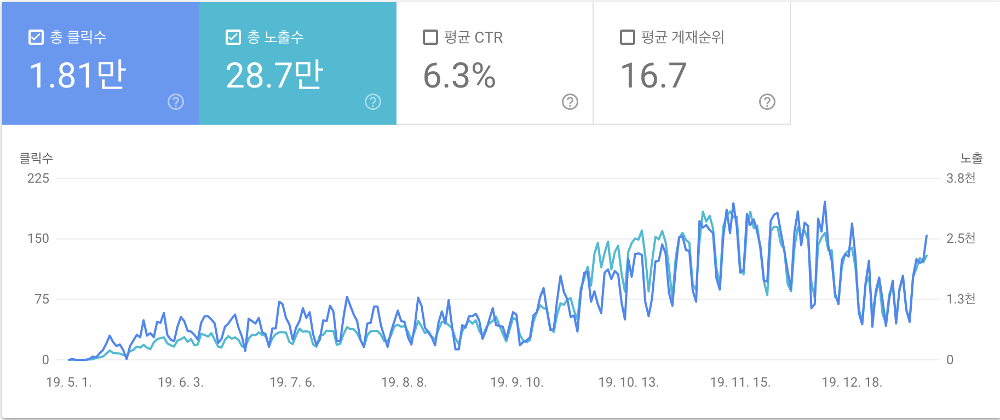
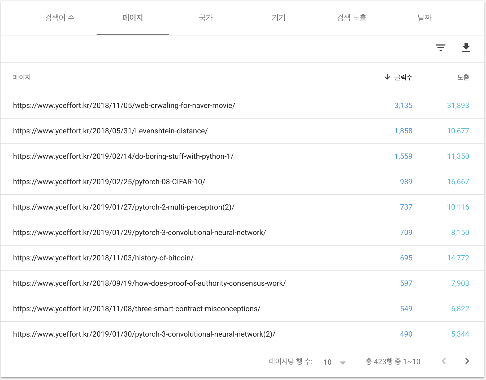
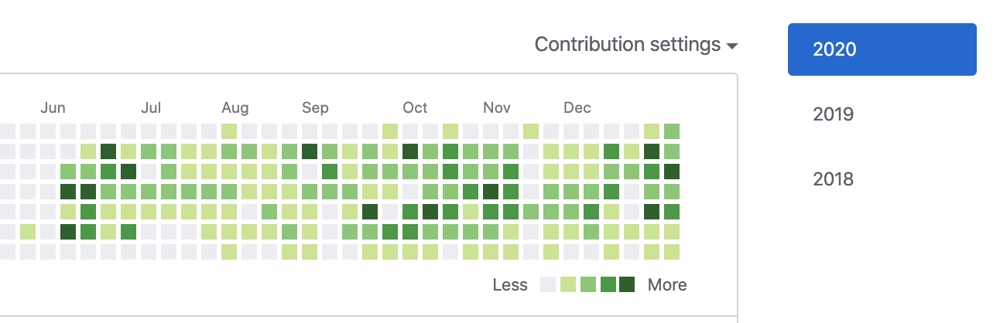

## 블로그의 성장

2018년 5월 1일에 블로그를 시작한 이례로 헛소리를 지껄이는 블로그에서, 제법 이사람 저사람 찾아오는 블로그로 성장했다.

구글 애드센스를 달아서 스벅 커피값이라도 벌고 싶은 유혹을 이기고, 아직 까지는 내돈 쓰면서 잘 버티고 있다. 그래도 뒤늦게 안 heroku와 cloudflare 덕분에 많은 돈 쓰지 않고, yceffort.kr 도메인 비용만 대고 있으니 샌프란시스코를 향해 절이라도 하고 싶다.

꾸준한 블로그 뻘 글과 회사에서 일하는 것 덕분에 github contribution에 초록색 불도 많이 들어오고 있다.

